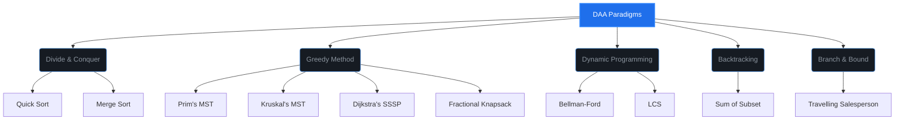

<div align="center">

<!-- Header Banner -->


<!-- Badges -->
<br/>


<br/>

<!-- Intro Text -->

> **A curated collection of optimized, high-performance C implementations for Design and Analysis of Algorithms (DAA).**  
> _Engineered to master algorithmic paradigms, analyze resource utilization, pass complex test cases on CodeTantra, and bridge theoretical complexity with practical execution._

<br/>

<!-- Quick Stats -->
<table>
<tr>
<td align="center"><b>📁 Practicals</b><br/><code>8 Modules</code></td>
<td align="center"><b>📄 Programs</b><br/><code>12 Solutions</code></td>
<td align="center"><b>🧠 Design Strategies</b><br/><code>5 Paradigms</code></td>
<td align="center"><b>⚡ Language</b><br/><code>Pure C</code></td>
</tr>
</table>

</div>

---

> [!TIP]
> **Divide & Conquer vs. Dynamic Programming:**  
> Divide & Conquer solves independent subproblems (no overlap), whereas Dynamic Programming is designed for overlapping subproblems and optimal substructure where memoization or tabulation prevents redundant computation.

> [!NOTE]
> All algorithms in this repository are designed with optimal space efficiency to satisfy CodeTantra's memory constraints and strict test case limits.

---

## 🗂️ Repository Structure

```
DAA-Solutions/
├── 📂 Practical - 01 (Sorting & Divide and Conquer)
│   ├── 1.1.1. Quick Sort.c
│   └── 1.1.2. Merge Sort - Divide and Conquer.c
├── 📂 Practical - 02 (Minimum Spanning Trees)
│   ├── 1.1.3. Minimum Spanning Tree using Prim's.c
│   └── 1.1.4. Minimum Spanning Tree using Kruskal's.c
├── 📂 Practical - 03 (Backtracking)
│   └── 1.1.5. Implement Sum of Subset Problem Using Backtracking.c
├── 📂 Practical - 04 (Shortest Path Algorithms)
│   ├── 1.1.6. Dijkstra's Shortest Path Algorithm.c
│   └── 1.1.7. Bellman-Ford algorithm.c
├── 📂 Practical - 05 (Graph Traversals)
│   ├── 1.1.9. Breadth First Search (BFS).c
│   └── 1.1.10. Depth-First Search (DFS).c
├── 📂 Practical - 06 (Greedy Method)
│   └── 1.1.11. Knapsack Problem.c
├── 📂 Practical - 07 (Dynamic Programming)
│   └── 1.1.12. Longest Common Sub Sequence.c
└── 📂 Practical - 08 (Branch and Bound)
    └── 1.1.13. Travelling Salesman Problem.c
```

---

## 📚 Detailed Module Breakdown

### ⚡ Practical 01 — Sorting & Divide and Conquer

<table>
<tr>
<th>📄 Program</th>
<th>📝 Description</th>
<th>⏱️ Time Complexity</th>
<th>🧠 Design Strategy / Space</th>
</tr>
<tr>
<td><b>1.1.1.</b> Quick Sort</td>
<td>Selects a pivot element, partitions the array around it, and recursively sorts the sub-arrays.</td>
<td>
<code>Best: O(n log n)</code><br/>
<code>Avg: O(n log n)</code><br/>
<code>Worst: O(n²)</code>
</td>
<td>
<b>Divide & Conquer</b><br/>
<code>O(log n)</code> (Call stack)
</td>
</tr>
<tr>
<td><b>1.1.2.</b> Merge Sort - Divide and Conquer</td>
<td>Recursively splits the array in half, sorts each half, and merges them using auxiliary arrays.</td>
<td>
<code>Best: O(n log n)</code><br/>
<code>Avg: O(n log n)</code><br/>
<code>Worst: O(n log n)</code>
</td>
<td>
<b>Divide & Conquer</b><br/>
<code>O(n)</code> (Aux space)
</td>
</tr>
</table>

---

### 🌲 Practical 02 — Minimum Spanning Trees

<table>
<tr>
<th>📄 Program</th>
<th>📝 Description</th>
<th>⏱️ Time Complexity</th>
<th>🧠 Design Strategy / Space</th>
</tr>
<tr>
<td><b>1.1.3.</b> Minimum Spanning Tree using Prim's</td>
<td>Greedily builds an MST from a starting vertex by repeatedly adding the cheapest edge connecting unvisited vertices.</td>
<td>
<code>Best: O(V²)</code><br/>
<code>Avg: O(V²)</code><br/>
<code>Worst: O(V²)</code>
</td>
<td>
<b>Greedy Method</b><br/>
<code>O(V)</code> (Adjacency Matrix)
</td>
</tr>
<tr>
<td><b>1.1.4.</b> Minimum Spanning Tree using Kruskal's</td>
<td>Sorts all graph edges in ascending order and greedily adds edges that do not form cycles using <b>Disjoint Set Union (DSU)</b>.</td>
<td>
<code>Best: O(E log E)</code><br/>
<code>Avg: O(E log E)</code><br/>
<code>Worst: O(E log E)</code>
</td>
<td>
<b>Greedy Method</b><br/>
<code>O(V + E)</code> (Parent array)
</td>
</tr>
</table>

---

### ↩️ Practical 03 — Backtracking

<table>
<tr>
<th>📄 Program</th>
<th>📝 Description</th>
<th>⏱️ Time Complexity</th>
<th>🧠 Design Strategy / Space</th>
</tr>
<tr>
<td><b>1.1.5.</b> Implement Sum of Subset Problem Using Backtracking</td>
<td>Finds subsets of positive integers that sum to a target value. Abandons search branches that exceed the target.</td>
<td>
<code>Best: O(2ⁿ)</code><br/>
<code>Avg: O(2ⁿ)</code><br/>
<code>Worst: O(2ⁿ)</code>
</td>
<td>
<b>Backtracking</b><br/>
<code>O(n)</code> (Recursion stack)
</td>
</tr>
</table>

---

### 🕸️ Practical 04 — Shortest Path Algorithms

<table>
<tr>
<th>📄 Program</th>
<th>📝 Description</th>
<th>⏱️ Time Complexity</th>
<th>🧠 Design Strategy / Space</th>
</tr>
<tr>
<td><b>1.1.6.</b> Dijkstra's Shortest Path Algorithm</td>
<td>Finds shortest paths from a source to all vertices on a weighted graph with non-negative weights by visiting closest nodes.</td>
<td>
<code>Best: O(V²)</code><br/>
<code>Avg: O(V²)</code><br/>
<code>Worst: O(V²)</code>
</td>
<td>
<b>Greedy Method</b><br/>
<code>O(V)</code> (Distance arrays)
</td>
</tr>
<tr>
<td><b>1.1.7.</b> Bellman-Ford algorithm</td>
<td>Computes single-source shortest paths on weighted graphs (supports negative weights) by relaxing all edges $V-1$ times.</td>
<td>
<code>Best: O(E)</code><br/>
<code>Avg: O(V*E)</code><br/>
<code>Worst: O(V*E)</code>
</td>
<td>
<b>Dynamic Programming</b><br/>
<code>O(V)</code> (Distance table)
</td>
</tr>
</table>

---

### 🗺️ Practical 05 — Graph Traversals

<table>
<tr>
<th>📄 Program</th>
<th>📝 Description</th>
<th>⏱️ Time Complexity</th>
<th>🧠 Design Strategy / Space</th>
</tr>
<tr>
<td><b>1.1.9.</b> Breadth First Search (BFS)</td>
<td>Explores graph nodes level-by-level starting from a source vertex using a queue structure.</td>
<td>
<code>Best: O(V + E)</code><br/>
<code>Avg: O(V + E)</code><br/>
<code>Worst: O(V + E)</code>
</td>
<td>
<b>Graph Traversal</b><br/>
<code>O(V)</code> (Queue & Visited)
</td>
</tr>
<tr>
<td><b>1.1.10.</b> Depth-First Search (DFS)</td>
<td>Explores as deep as possible along each branch of a graph before backtracking recursively.</td>
<td>
<code>Best: O(V + E)</code><br/>
<code>Avg: O(V + E)</code><br/>
<code>Worst: O(V + E)</code>
</td>
<td>
<b>Graph Traversal</b><br/>
<code>O(V)</code> (Visited tracking)
</td>
</tr>
</table>

---

### 💰 Practical 06 — Greedy Method

<table>
<tr>
<th>📄 Program</th>
<th>📝 Description</th>
<th>⏱️ Time Complexity</th>
<th>🧠 Design Strategy / Space</th>
</tr>
<tr>
<td><b>1.1.11.</b> Knapsack Problem</td>
<td>Maximizes value of items in a capacity-limited knapsack. Implements Greedy Fractional knapsack logic.</td>
<td>
<code>Best: O(n log n)</code><br/>
<code>Avg: O(n log n)</code><br/>
<code>Worst: O(n log n)</code>
</td>
<td>
<b>Greedy Method</b><br/>
<code>O(n)</code> (Sorting array)
</td>
</tr>
</table>

---

### 📈 Practical 07 — Dynamic Programming

<table>
<tr>
<th>📄 Program</th>
<th>📝 Description</th>
<th>⏱️ Time Complexity</th>
<th>🧠 Design Strategy / Space</th>
</tr>
<tr>
<td><b>1.1.12.</b> Longest Common Sub Sequence</td>
<td>Finds the longest common subsequence of two strings by tabulating matching prefix lengths bottom-up.</td>
<td>
<code>Best: O(m*n)</code><br/>
<code>Avg: O(m*n)</code><br/>
<code>Worst: O(m*n)</code>
</td>
<td>
<b>Dynamic Programming</b><br/>
<code>O(m*n)</code> (LCS table)
</td>
</tr>
</table>

---

### ⛓️ Practical 08 — Branch and Bound

<table>
<tr>
<th>📄 Program</th>
<th>📝 Description</th>
<th>⏱️ Time Complexity</th>
<th>🧠 Design Strategy / Space</th>
</tr>
<tr>
<td><b>1.1.13.</b> Travelling Salesman Problem</td>
<td>Computes the shortest path visiting all cities once and returning to source using Branch and Bound state-space search.</td>
<td>
<code>Best: O(2ⁿ * n²)</code><br/>
<code>Avg: O(2ⁿ * n²)</code><br/>
<code>Worst: O(n!)</code>
</td>
<td>
<b>Branch and Bound</b><br/>
<code>O(2ⁿ * n)</code> (Active states)
</td>
</tr>
</table>

---

## 📊 Complexity Comparison Chart

```
Algorithm Performance Overview (Time Complexity — Worst Case)
═════════════════════════════════════════════════════════════

BFS / DFS       ██████                                      O(V + E)
Merge Sort      ████████████                                O(n log n)
Quick Sort      ██████████████████                          O(n²)
Prim's (MST)    ██████████████████                          O(V²)
Dijkstra's      ██████████████████                          O(V²)
Bellman-Ford    ████████████████████████                    O(V * E)
LCS (DP)        ████████████████████████████                O(m * n)
TSP (B&B)       ██████████████████████████████████          O(N!)
Sum of Subsets  ██████████████████████████████████████████  O(2ⁿ)

                ◄─── Faster                    Slower ───►
```

---

## 💡 Algorithmic Paradigms Visual Map



---

## 🚀 Getting Started

### Prerequisites

Ensure you have a **C compiler** installed on your system:

| Compiler | Platform  | Install Command                                                                                      |
| -------- | --------- | ---------------------------------------------------------------------------------------------------- |
| GCC      | Linux/Mac | `sudo apt install gcc` or `brew install gcc`                                                         |
| MinGW    | Windows   | [Download MinGW](https://sourceforge.net/projects/mingw/)                                            |
| Turbo C  | Windows   | [Download Turbo C](https://developerinsider.co/download-turbo-c-for-windows-7-8-8-1-and-windows-10/) |

### Compile & Run

```bash
# Navigate into the project root
cd DAA-Solutions

# Compile any program (example: Quick Sort)
gcc "Practical - 01 (Sorting & Divide and Conquer)/1.1.1. Quick Sort.c" -o quick_sort

# Run the compiled program
./quick_sort
```

---

## 🤝 Contributing

Contributions are welcome! If you'd like to add more programs or optimize existing ones:

1. **Fork** the repository
2. **Create** a new branch (`git checkout -b feature/new-algorithm`)
3. **Commit** your changes (`git commit -m "Add: Bellman-Ford algorithm implementation"`)
4. **Push** to the branch (`git push origin feature/new-algorithm`)
5. **Open** a Pull Request

---

## 👤 Author

<div align="center">

<table>
<tr>
<td align="center">
<b>Sameer Karadbhajne</b><br/>
<a href="https://github.com/Sameerkaradbhajne">

</a>
</td>
</tr>
</table>

</div>

---

## ⭐ Show Your Support

If this repository helped you learn or practice DAA, please consider giving it a **⭐ star** — it keeps the motivation going!

<div align="center">


</div>
